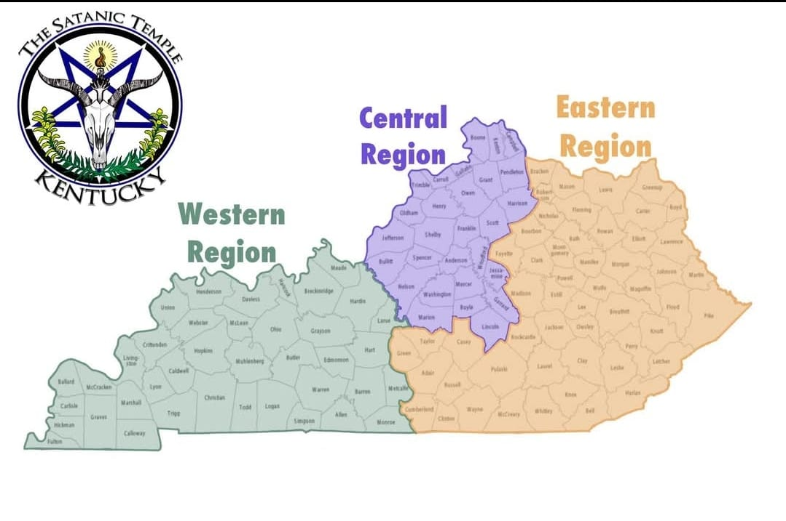

# TSTKYSAFE

The purpose of this site is to create a way for people to check in and see who else is present in different parts of Kentucky—or beyond—without sacrificing their anonymity.  
You may have to disclose some data, but it will be kept private and protected.

We're too broke to sell your data, but we're smart enough to secure it.

Using the Google API and mapping tools, we’ll create a drag-and-drop interface so users can check in with approximate locations. This can also be used to alert others in your area—or everyone—if you choose to share. Checkin location can also be turned off or on which might alert people in a specified range. 

The ultimate goal isn’t just a community roll call.  
It’s a **safe haven** for people who might not otherwise have one.  

Living rough is hard. You shouldn't have to do it alone.

---

### Developer: Eoin McDonnell  
**Tools**: Vue.js frontend, Laravel backend, Google Maps API

Admin access only by yubi-key, FICO2 auth, if keys are lost there is no fail safe. We would rather everyone be safe and lose all inforamation. 

---

## Project Structure

php artisan serve

API availab le at http://127.0.0.1:8000

## Getting Started

### Prerequisites
- PHP 8.1+ (we're using 8.2.4 via XAMPP)
- Composer (2.8+)
- Node.js & npm (for Vue frontend)

---

### 🖥 Backend (Laravel API)

## To set up the backend API, follow the instructions in backend/setup.md
